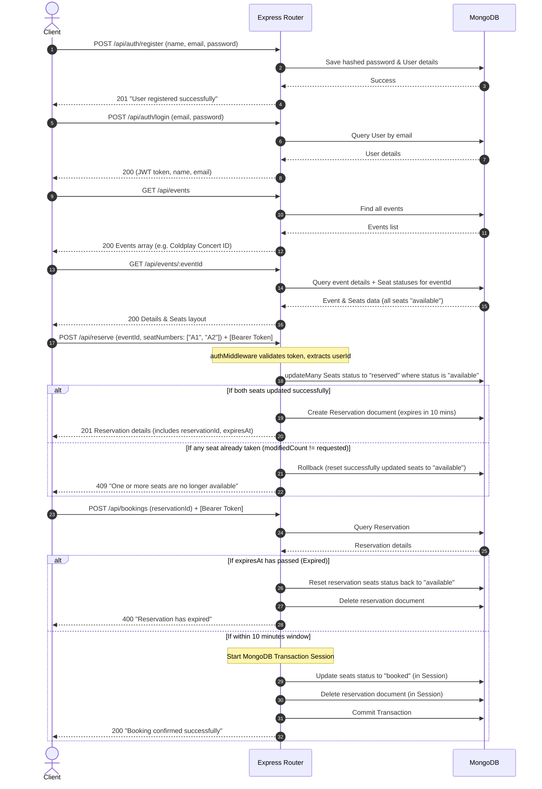

# SortMyScene Backend — Developer Guide & Explanation

Welcome to the backend of **SortMyScene**! This guide is written specifically to help you understand how this Node.js + Express + MongoDB backend works, how the files are structured, and how the core functionalities (like security, concurrency control, and transactions) are handled under the hood.

---

## 1. The Architecture (MVC Pattern)

Our backend follows a modern variation of the **MVC (Model-View-Controller)** architecture. In a web API, there is no "View" (since the frontend handles the visual display). Instead, we have:

1. **Entry Point (`server.js`)**: The main gateway that starts the Express server, connects to the database, and registers general middleware.
2. **Models (`/models`)**: Defines the shape/schema of our data in MongoDB (the blueprint of what goes into our database).
3. **Routes (`/routes`)**: The URL pathways (endpoints) exposed to the internet. They receive requests and map them to specific controller functions.
4. **Controllers (`/controllers`)**: The "brain" of the app. This is where the actual business logic, calculations, checks, database queries, and responses live.
5. **Middleware (`/middleware`)**: Guards or helpers that run *before* the request reaches the controllers (e.g., checking if a user is logged in).

---

## 2. File Directory & Code Explanation

Let's break down each file we edited and created, folder by folder.

---

### 📂 Configuration & Setup

#### 1. [.env](file:///c:/Users/HP/Desktop/React-10-Projects/project-13%28sort%20my%20scene%29/server/.env)
* **What it is**: The environment variables configuration file.
* **What it does**: Holds sensitive credentials and settings (Port, JWT Secret Key, MongoDB URI). This file is ignored by Git (via `.gitignore`) so your database password is never exposed on GitHub.

#### 2. [config/db.js](file:///c:/Users/HP/Desktop/React-10-Projects/project-13%28sort%20my%20scene%29/server/config/db.js)
* **What it is**: Database connection module.
* **How it works**: Uses `mongoose.connect()` to open a connection to the MongoDB Atlas cluster specified in your `.env`. If it fails, it prints the error and stops the app (`process.exit(1)`).

---

### 📂 Database Blueprints (Mongoose Models)

Mongoose schemas tell MongoDB what fields a document must have, their data types, and validations.

#### 1. [models/User.js](file:///c:/Users/HP/Desktop/React-10-Projects/project-13%28sort%20my%20scene%29/server/models/User.js)
* **What it does**: Stores user profile data.
* **Fields**:
  * `name` (String, required)
  * `email` (String, required, unique so no two users have the same email)
  * `password` (String, required)
  * `timestamps: true` (adds `createdAt` and `updatedAt` dates automatically)

#### 2. [models/Event.js](file:///c:/Users/HP/Desktop/React-10-Projects/project-13%28sort%20my%20scene%29/server/models/Event.js)
* **What it does**: Stores event details (concerts, summits).
* **Fields**:
  * `name`, `dateTime`, `venue`, `totalSeats`.

#### 3. [models/Seat.js](file:///c:/Users/HP/Desktop/React-10-Projects/project-13%28sort%20my%20scene%29/server/models/Seat.js)
* **What it does**: Represents individual seats for a specific event.
* **Fields**:
  * `eventId` (References the `Event` model)
  * `seatNumber` (e.g., `"A1"`, `"B5"`)
  * `status` (Enum restricted to: `"available"`, `"reserved"`, or `"booked"`. Defaults to `"available"`)
* **Compound Index**: `{ eventId: 1, seatNumber: 1 }` with `{ unique: true }`. This is a database safety net ensuring that we can never create duplicate seat numbers for the same event in the database.

#### 4. [models/Reservation.js](file:///c:/Users/HP/Desktop/React-10-Projects/project-13%28sort%20my%20scene%29/server/models/Reservation.js)
* **What it does**: Tracks temporary reservations before a user pays/confirms their booking.
* **Fields**:
  * `userId` and `eventId` (references to the user and event)
  * `seatNumbers` (Array of strings representing the seats, e.g., `["A1", "A2"]`)
  * `expiresAt` (A Date object specifying when the reservation expires)

---

### 📂 The "Guard" (Middleware)

#### [middleware/authMiddleware.js](file:///c:/Users/HP/Desktop/React-10-Projects/project-13%28sort%20my%20scene%29/server/middleware/authMiddleware.js)
* **What it is**: An interceptor that secures routes.
* **How it works**:
  1. Inspects the incoming request's `Authorization` header.
  2. Extracts the token (formatted as `Bearer <token>`).
  3. Verifies the token using `jwt.verify` and your `JWT_SECRET`.
  4. If valid, it attaches the decoded token data (which has the user's `userId`) to the request object: `req.user = decoded`.
  5. Calls `next()`, passing control to the actual controller. If invalid or missing, it blocks the request immediately with a `401 Unauthorized` response.

---

### 📂 The Logic Controllers (`/controllers`)

This is where the magic happens. Let's break down the logic step-by-step.

#### 1. [controllers/authController.js](file:///c:/Users/HP/Desktop/React-10-Projects/project-13%28sort%20my%20scene%29/server/controllers/authController.js)
* **`register`**:
  1. Validates that `name`, `email`, and `password` are sent.
  2. Queries the DB to check if the email is already in use (returns `409 Conflict` if it is).
  3. Hashes the password using `bcryptjs` with `10` salt rounds (so plain passwords are never saved in the DB).
  4. Saves the user document.
* **`login`**:
  1. Finds the user by `email` (returns `404 Not Found` if missing).
  2. Compares the plain-text password sent in the request with the hashed password in the DB using `bcrypt.compare` (returns `401 Unauthorized` if incorrect).
  3. Signs a **JSON Web Token (JWT)** containing the `userId`, configured to expire in `7 days`.
  4. Returns the signed `token`, `name`, and `email`.

#### 2. [controllers/eventController.js](file:///c:/Users/HP/Desktop/React-10-Projects/project-13%28sort%20my%20scene%29/server/controllers/eventController.js)
* **`getAllEvents`**: Simply calls `Event.find()` and returns the array of events.
* **`getEventById`**: 
  1. Finds the event matching the ID passed in the URL parameters (`req.params.id`). If not found, returns `404`.
  2. Queries the `Seat` collection to pull all seats matching that `eventId`.
  3. Returns a JSON object containing both the `event` details and the `seats` array with their current booking statuses.

#### 3. [controllers/reserveController.js](file:///c:/Users/HP/Desktop/React-10-Projects/project-13%28sort%20my%20scene%29/server/controllers/reserveController.js)
* **`reserveSeats` (Atomic Double-Booking Prevention)**:
  How do we ensure two users who click "Reserve" at the exact same millisecond don't get the same seat?
  1. We execute an **atomic database update query** on the `Seat` collection:
     ```javascript
     const result = await Seat.updateMany(
       {
         eventId: eventId,
         seatNumber: { $in: seatNumbers },
         status: "available" // Only match if the seat is currently available
       },
       { $set: { status: "reserved" } }
     );
     ```
  2. MongoDB is single-threaded at the document-write level. If User A's query arrives 1 microsecond before User B's, User A's query will update the seat status to `"reserved"`.
  3. When User B's query executes, it fails to find the seat matching `{ status: "available" }`.
  4. We compare the `result.modifiedCount` with the length of the requested `seatNumbers`.
  5. If they match, the reservation succeeds, we save a `Reservation` document with a `10 minutes` expiration date, and return it.
  6. If they do **not** match (e.g., you requested 2 seats, but only 1 got updated), we execute a **Rollback**: we reset any of those requested seats that were successfully changed to `"reserved"` back to `"available"`, and return `409 Conflict` ("One or more seats are no longer available").

#### 4. [controllers/bookingController.js](file:///c:/Users/HP/Desktop/React-10-Projects/project-13%28sort%20my%20scene%29/server/controllers/bookingController.js)
* **`confirmBooking` (MongoDB Multi-Document Transactions)**:
  To confirm a booking, we must do two things: change seat status to `"booked"`, and delete the temporary `Reservation` document. If one succeeds but the other fails, our database gets corrupted. To prevent this, we use Mongoose transactions.
  1. We fetch the `Reservation` document by ID.
  2. **Expiry Check**: We compare the reservation's `expiresAt` with the current time. If it has expired:
     * We update the seats back to `"available"`.
     * We delete the expired reservation.
     * We abort and return `400 Bad Request` ("Reservation has expired").
  3. If not expired, we start a Mongoose transaction session:
     ```javascript
     session.startTransaction();
     ```
  4. Inside the transaction:
     * We update the seats' status to `"booked"` (passing `{ session }`).
     * We delete the reservation document (passing `{ session }`).
  5. If both queries execute successfully, we **commit** the transaction (`session.commitTransaction()`), saving both changes permanently.
  6. If any step fails or throws an error, the `catch` block catches the error and executes `session.abortTransaction()`, ensuring that **neither** change is saved. Mongoose resets everything back to before the transaction started.

---

### 📂 The Gateway Routes (`/routes`)

These map HTTP methods and URLs to controller handlers.

* **[routes/authRoutes.js](file:///c:/Users/HP/Desktop/React-10-Projects/project-13%28sort%20my%20scene%29/server/routes/authRoutes.js)**:
  * `POST /api/auth/register` → runs `register` controller
  * `POST /api/auth/login` → runs `login` controller
* **[routes/eventRoutes.js](file:///c:/Users/HP/Desktop/React-10-Projects/project-13%28sort%20my%20scene%29/server/routes/eventRoutes.js)**:
  * `GET /api/events` → lists all events
  * `GET /api/events/:id` → gets specific event + seat statuses
* **[routes/reserveRoutes.js](file:///c:/Users/HP/Desktop/React-10-Projects/project-13%28sort%20my%20scene%29/server/routes/reserveRoutes.js)**:
  * `POST /api/reserve` → passes through `authMiddleware` → runs `reserveSeats` controller
* **[routes/bookingRoutes.js](file:///c:/Users/HP/Desktop/React-10-Projects/project-13%28sort%20my%20scene%29/server/routes/bookingRoutes.js)**:
  * `POST /api/bookings` → passes through `authMiddleware` → runs `confirmBooking` controller

---

### 📂 App Entry Point (`server.js`)

#### [server.js](file:///c:/Users/HP/Desktop/React-10-Projects/project-13%28sort%20my%20scene%29/server/server.js)
This file binds the whole application together:
1. **Imports**: Loads `express`, `cors`, configuration helpers, and routing groups.
2. **Middleware Binding**:
   * `app.use(cors())`: Allows frontend clients hosted on other domains to access our APIs.
   * `app.use(express.json())`: Parses incoming requests containing JSON payloads (makes `req.body` readable).
3. **Route Mounting**: Connects all of our routes to the application.
4. **Global Error Handler**: A catch-all middleware positioned at the bottom of the server file. If any controller calls `next(error)`, Express forwards the error here to respond with a clean, structured JSON error message, preventing the app from crashing.
5. **Seeding Logic (`seedDB`)**: Runs at startup. Checks if there are any events in the DB. If the DB is empty, it automatically populates the database with:
   * "Coldplay Concert" (and generates seats A1-A10 and B1-B10)
   * "Tech Summit 2025" (and generates seats A1-A10 and B1-B5)
6. **Server Listen**: Establishes the database connection first, triggers seeding, and starts listening for HTTP requests on the designated port (default 5000).

---

## 3. The Lifecycle of a Seat Booking (Step-by-Step Flow)

Here is how a client interacts with this backend to book a ticket:



---

## 4. Simplified User Flow (Plain English)

Here is a step-by-step example of what a user does when using our application:
1. **Register**: The user creates a new account (e.g. `john@example.com`).
2. **Login**: The user logs in and gets a security badge (called a **JWT Token**). They must include this badge in their requests when reserving or booking.
3. **Browse**: The user views the listed events (like the Coldplay Concert) and checks which seats (e.g. `A1`, `A2`) are currently free (`"available"`).
4. **Reserve**: The user places a temporary hold on seats `A1` and `A2`. 
   * These seats are marked as `"reserved"` so nobody else can take them.
   * The user now has exactly **10 minutes** to pay/confirm.
5. **Book**: Within those 10 minutes, the user confirms the purchase. 
   * The seats permanently change to `"booked"`.
   * The temporary hold (reservation) is deleted.
   * If the user takes longer than 10 minutes, the hold expires, the seats are freed back to `"available"`, and the booking is blocked.

---

## 5. Summary of Key Constraints & Solutions

Here is a simple summary of the backend safety rules we built and how we solved them:

| Safety Rule (Constraint) | The Problem (Risk) | Our Solution (How we solved it) |
| :--- | :--- | :--- |
| **No Double Booking** | Two users click "Reserve A1" at the same microsecond. Both get it. | We check `{ status: "available" }` inside an **atomic update query**. If the update count doesn't match the requested seats, we cancel the update entirely and reject the second user. |
| **Atomic Confirmations** | The server marks seats as `"booked"`, but crashes before deleting the reservation. Data is now corrupt. | We wrap both operations in a **Mongoose Database Transaction**. If one query fails, the database automatically undoes (rolls back) the other query. It's "all-or-nothing". |
| **Reservation Expiry** | A user reserves seats and leaves their browser open. The seats are locked forever. | We set a **10-minute timer (`expiresAt`)** on the reservation. When confirming, if this timer has passed, the server deletes the reservation, resets the seats to `"available"`, and returns an error. |

